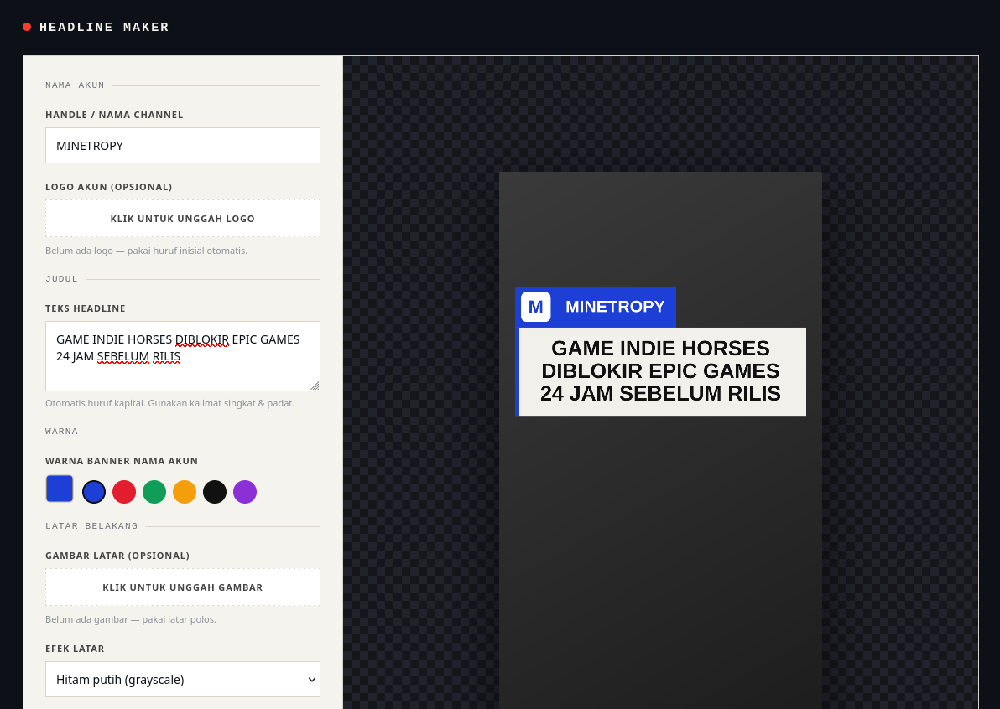

# Headline Maker

Generator template headline gaya "breaking news" untuk konten TikTok/Reels — buat judul, nama akun, dan gambar latar, lalu unduh sebagai PNG. Semua proses berjalan langsung di browser, tanpa upload ke server manapun.



## Fitur

- Input judul otomatis huruf kapital, dengan pembatasan maksimal 3 baris (font menyesuaikan otomatis)
- Nama akun/handle custom dengan pilihan warna banner
- Upload logo sendiri (opsional), fallback ke huruf inisial otomatis
- Upload gambar latar belakang dengan efek grayscale / gelap / normal
- Pilihan rasio ekspor: 9:16 (TikTok/Reels), 1:1 (Square), 4:5 (Portrait)
- Unduh hasil akhir langsung sebagai file PNG

## Cara Pakai

1. Buka [index.html](index.html) secara lokal, atau langsung akses demo online di **[headline-maker.vercel.app](https://headline-maker.vercel.app/)** (tidak perlu server atau instalasi apapun)
2. Isi nama akun dan judul headline
3. (Opsional) unggah logo dan/atau gambar latar belakang
4. Pilih warna banner dan rasio ekspor sesuai kebutuhan
5. Klik **"Unduh sebagai PNG"**

## Teknologi

Murni HTML, CSS, dan JavaScript (Canvas API) — tidak ada dependency eksternal, tidak ada build step.

## Menjalankan Secara Lokal

```bash
git clone https://github.com/USERNAME/NAMA-REPO.git
cd NAMA-REPO
```

Lalu cukup buka file `headline-generator.html` langsung di browser.

## Lisensi

Bebas digunakan dan dimodifikasi untuk keperluan pribadi maupun konten kreator.
